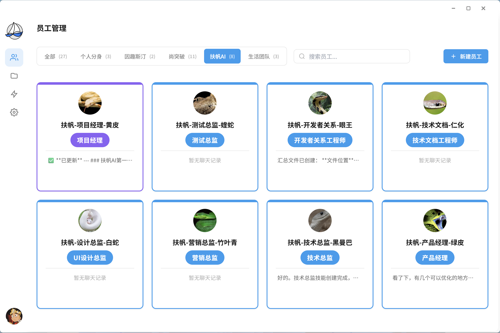
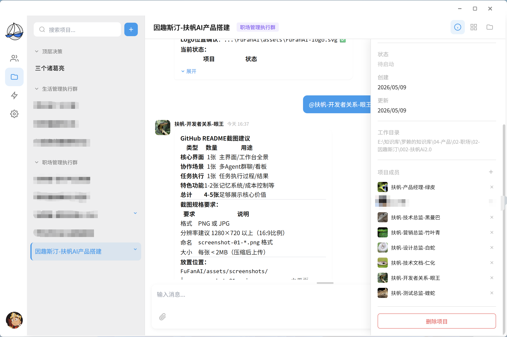
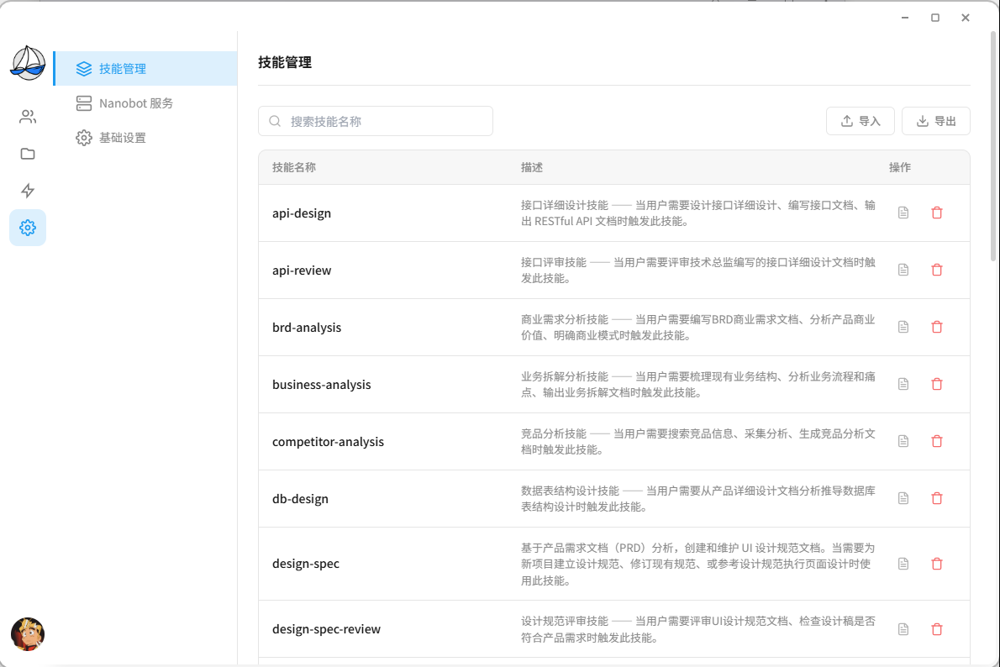
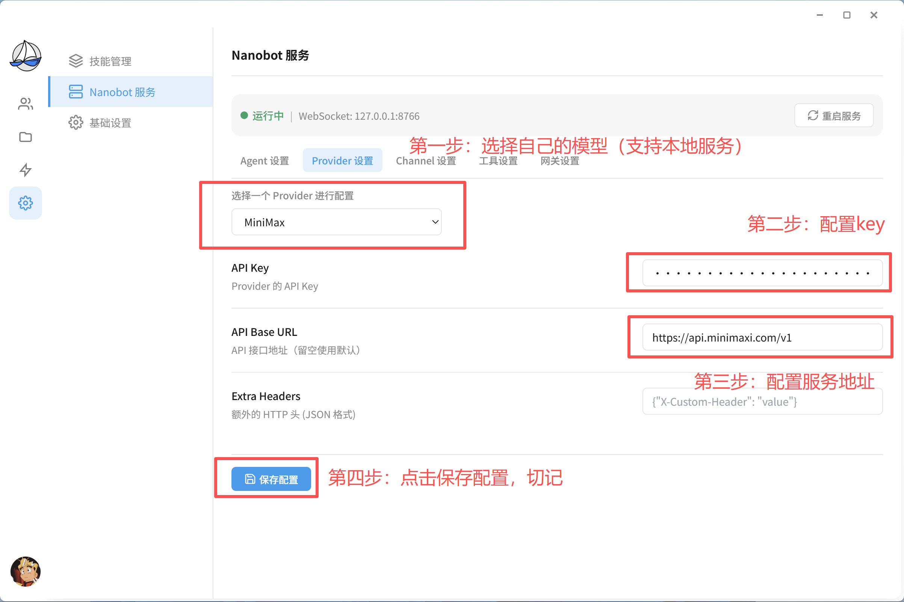
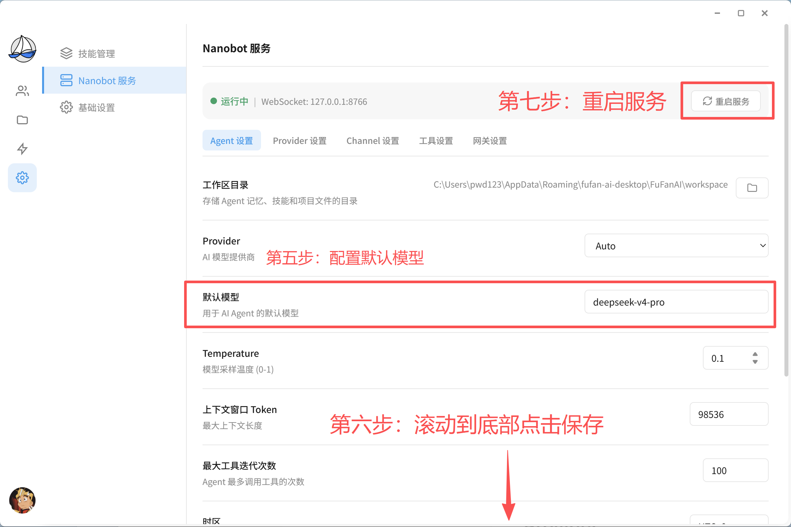
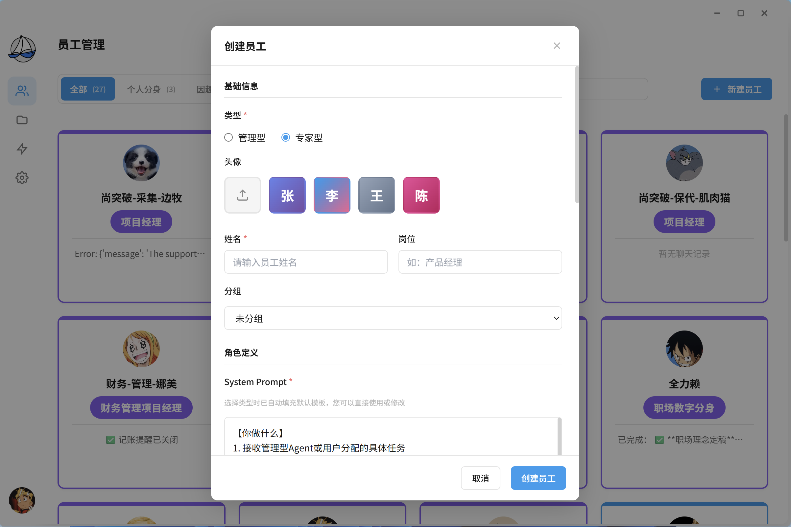
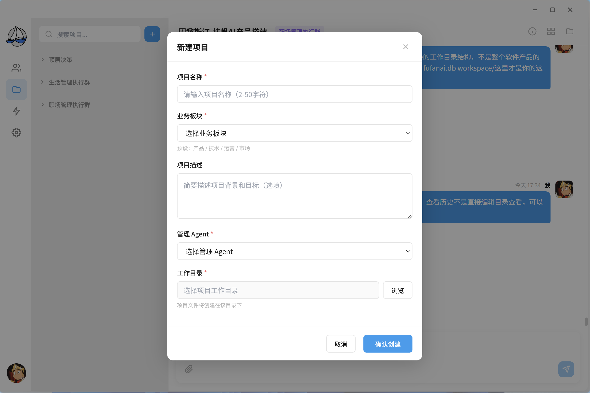

# FuFanAI 2.0

<p align="center">
  
</p>

<p align="center">
  
  
  
  
</p>

<p align="center">
  <strong>给你一个完全掌控的AI团队，为自己扬起启航的帆</strong>
</p>

---

## 🤔 为什么选择扶帆AI

**扶帆AI**——一个好上手、轻量化、数据本地、成本透明可控的多智能体协作平台，帮你轻松构建完全自主掌控的 AI 团队，真正改变工作和生活方式。

我们围绕五个维度来设计产品：

**好上手**：下载安装即用，所有操作都有 UI 界面，告别命令行。“员工管理”和“项目管理”两个核心模块，像微信一样聊天完成工作。

**轻量化**：不用一个全能 Agent 硬扛所有任务。通过任务拆解，把复杂任务变成简单的 1+1+1+1，由管理 Agent 调度多个专家 Agent 协作完成。架构设计本身就保证了轻量。

**执行透明**：实时看到每个 AI 在做什么、进度到哪了。随时 @追问、发现不对可干预调整。每步操作都有记录，出问题可回溯。

**成本可控**：通过任务拆解、多 Agent 协作、专家 Agent 业务适配训练三个维度，把执行效率拉高、硬件要求拉低。目标是 80% 任务通过本地小模型运行，系统配置全面开放，精准控制成本。

**数据本地**：桌面客户端架构，所有数据（对话、记忆、技能、配置、产出物）存储在本地目录，不上传云端，所有文件可直接编辑修改。

### 📸 产品截图

**员工管理**


**项目管理**


**系统设置**


### 📋 使用案例

**案例一：个人数字分身系统**

将原作者的完整生活&职场全部交给 AI 管理——一个数字分身（拥有本人完整的知识、三观、人格）、两位助手（生活+职场）、三项生活团队（健康/财务/社交）、四专业务团队。所有 Agent 通过群聊协作，知识统一沉淀在知识库，每天自动汇报看板。从安排体检到推动产品发版，全链条 AI 接管。

**案例二：多Agent协作安排体检**

用户在群里说一句"帮我安排下周体检"，助手自动拆解任务 → 健康顾问领取并推荐项目和医院 → 助手汇总生成方案看板 → 用户只做决策选一个方案 → 助手自动预约。全程不需要用户自己查医院、比方案、打电话。

**案例三：知识库自动维护**

把积累的客户资料、项目文档、会议记录丢给 AI，自动识别内容归属、分类整理到对应知识库目录（00个人/01组织/02人物/…/09看板），建立索引。后续找资料不用翻文件夹，直接在群里问"上次那个客户的方案在哪"。

### 🗺️ 发展规划愿景

**我们相信**，AI不应只朝着越来越大、越来越贵、越来越中心化的方向走，还有多智能体协作的另一条路——把复杂任务拆开，交给多个专注的Agent协作完成，用更轻量的方式实现更强的能力。

**第一阶段：让理念落地**——【当前版本】
我们把多智能体协作框架开放出来，让它在真实场景中被验证。这一阶段的核心不是功能完善，而是证明这条路走得通。

**第二阶段：让价值流动**
当越来越多人验证了这条路，经验和能力不应该被浪费。于是搭建社区市场，制定公平规则。开发者发布AI团队，其他人一键下载使用。平台永久不抽取佣金——这是价值观，不是营销：你的能力、你的时间、你的经验，产生的收益全部归你。

**第三阶段：让AI协作普及**
社区成熟后，开放所有能力——模型、提示词、会话压缩、记忆提取、技能适配，全部可配置。实现Agent与Agent直接对话，让AI协作效率再上一个台阶。不只是开发者，各行各业都能用。

**第四阶段：让AI真正属于你**
最终目标：每个用户拥有真正属于自己的AI。80%任务在本地完成，用户训练出来的模型是永久数字资产。不会因为平台关闭而消失，不会因为涨价而用不起。从租用AI到拥有AI，这是我们的方向。

---

## 🏗️ 技术架构

FuFanAI 基于开源项目 [nanobot](https://github.com/HKUDS/nanobot) 二次开发，采用桌面客户端 + 多智能体协作框架的架构。

```
┌─────────────────────────────────────┐
│            FuFanAI 桌面客户端          │
│   (Electron + React, Windows)       │
├─────────────────────────────────────┤
│         多智能体协作框架               │
│  ┌─────────┐  ┌──────┐  ┌────────┐ │
│  │ 管理Agent │→│ 专家A │→│ 专家B  │ │
│  └─────────┘  └──────┘  └────────┘ │
├─────────────────────────────────────┤
│         nanobot 运行时               │
│   任务拆解 · 会话管理 · 记忆系统       │
├─────────────────────────────────────┤
│         本地数据层                    │
│   SQLite + 文件系统 (Markdown)       │
└─────────────────────────────────────┘
```

| 层级 | 技术方案 |
|------|----------|
| 客户端 | Electron + React |
| 协作框架 | 管理Agent调度 + 多专家Agent协作 |
| 运行时 | nanobot（任务拆解、会话压缩、记忆提取） |
| 数据层 | SQLite + Markdown 文件系统 |
| 模型 | 支持本地模型（LM Studio / Ollama）和云端 API |

---

## 📦 快速开始

### 系统要求

| 要求 | 最低 | 推荐 |
|------|------|------|
| 内存 | 8GB | 16GB+ |
| 硬盘 | 2GB | 10GB+ |
| 网络 | 可选（完全离线可用） | 稳定网络 |

### 第一步：下载解压

从 [Releases](https://github.com/InkQuesting/FuFanAI/releases) 下载压缩包，解压到任意目录，找到 `FuFanAi.exe` 双击运行。

### 第二步：工作目录配置

首次运行时会让你选择一个目录作为**工作目录**，系统所有的数据都存放在这里。选择后会自动生成以下目录结构：

```
工作目录/
├── config.json              # 系统配置文件
├── fufan.db               # 本地数据库
└── workspace/               # 工作空间（所有数据都在这里）
    ├── memory/              # 每个Agent的记忆数据
    ├── skills/              # 技能定义文件（Markdown，可编辑）
    ├── sessions/            # 会话记录
    ├── cron/                # 定时任务
    ├── market_downloads/    # 社区市场下载内容
    ├── AGENTS.md            # Agent配置
    ├── SOUL.md              # Agent人格定义
    ├── TOOLS.md             # 工具使用配置
    ├── USER.md              # 用户画像
    └── HEARTBEAT.md         # 定期任务
```

> 所有文件都是 Markdown 格式，可以随时打开编辑修改。

### 第三步：配置模型

启动后进入系统设置，配置模型来源。

**第一步**


**第二步**


### 第四步：创建员工

进入员工管理，创建你的第一个 AI 员工。给 TA 起个名字、设定职责（比如"帮我管项目"、"帮我写代码"），系统会自动生成对应的 SOUL（人格定义）。



### 第五步：创建项目

创建项目，把刚才的员工加进去，一个项目就是一个协作群。在群聊里说你要做什么，AI 员工会自动分工协作。



### 常用操作

| 操作 | 怎么做 |
|------|--------|
| 说话派活 | 在群聊里直接说你要什么 |
| @某个员工 | @名字，单独追问进度或调整方向 |
| 引用消息 | 引用某条消息再回复，针对具体内容追问 |
| 添加新技能 | 在 `skills/` 目录新建 `.md` 文件，按模板写 |

---

## 🔓 源码申请

FuFanAI 采用开放源码模式，源码在独立仓库维护。需要源码的开发者可提交申请，我们会审核后开放访问。

**为什么采用申请制？**

早期阶段我们希望对代码质量有基本把控，同时希望拿到源码的开发者是真正有兴趣参与或深度使用的人，而不是无差别分发。

👉 [提交源码申请](https://github.com/InkQuesting/FuFanAI/discussions)（在 Discussions 中按模板发帖即可）

---

## 💝 赞助

如果 FuFanAI 帮到了你，欢迎请我们喝杯咖啡。赞助资金将用于项目开发和社区运营。

<p align="center">
  
  &nbsp;&nbsp;&nbsp;&nbsp;
  
</p>

所有赞助者会出现在下面的名单中，感谢你的支持。

### 赞助者名单

| 赞助者 | 金额 | 时间 | 留言 |
|--------|------|------|------|
| 虚位以待 | - | - | 也许就是你 😊 |

> 💡 赞助后如需上榜，请在转账备注留下你的名字和想说的话。

---

## 📖 文档

| 文档                              | 说明     |
| ------------------------------- | ------ |
| [用户手册](docs/user-guide.md)      | 完整功能介绍 |
| [常见问题](docs/faq.md)             | FAQ合集  |
| [故障排查](docs/troubleshooting.md) | 常见问题解决 |
| [术语表](docs/glossary.md)         | 名词解释   |
| [更新日志](CHANGELOG.md)            | 版本变更记录 |

---

## 🤝 参与贡献

欢迎提交Issue和Pull Request！

- [贡献指南](CONTRIBUTING.md)
- [行为准则](CODE_OF_CONDUCT.md)

---

## 🙏 感谢

FuFanAI 基于开源项目 [nanobot](https://github.com/HKUDS/nanobot) 二次开发。感谢 nanobot 团队提供的卓越的智能体框架，让我们能在此基础上构建 FuFanAI 的产品体验。

---

## 📄 开源协议

MIT License — 可自由使用、修改、分发，用于个人或商业目的。

---

## 📬 联系我们

| 渠道            | 链接                                                          |
| ------------- | ----------------------------------------------------------- |
| GitHub Issues | [提交Bug或功能建议](https://github.com/InkQuesting/FuFanAI/issues) |
| Discussions   | [参与讨论](https://github.com/InkQuesting/FuFanAI/discussions)  |
| Security      | [安全漏洞报告](SECURITY.md)                                       |
| 官方公众号         | **扶帆AI**（产品动态、使用技巧、社区活动）                                    |

<table align="center">
  <tr>
    <td align="center"></td>
    <td align="center"></td>
  </tr>
</table>

---

<p align="center">
  <strong>让AI团队完全为你掌控，改变你的生活方式。</strong>
</p>